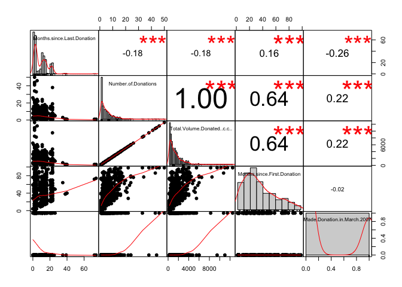
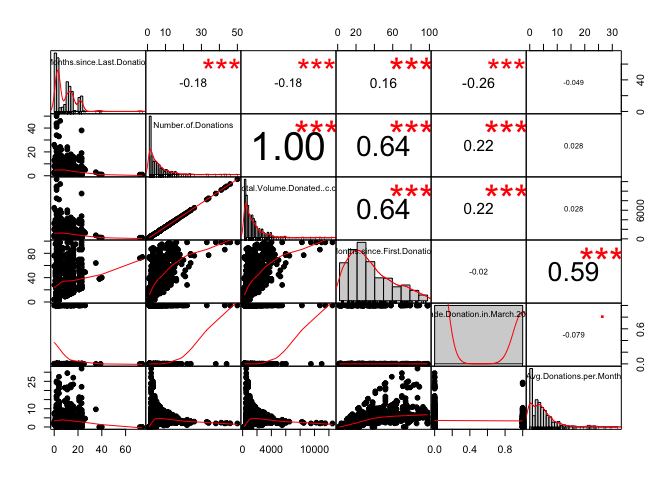
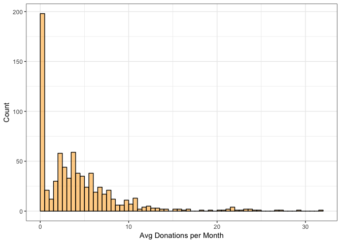
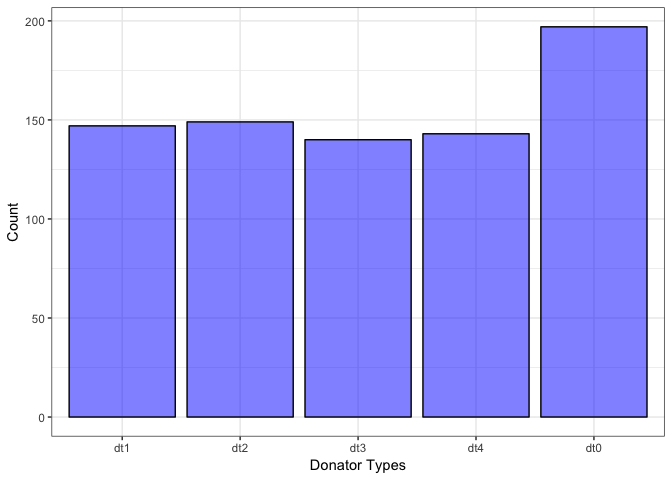
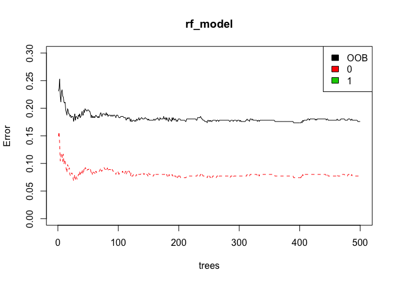
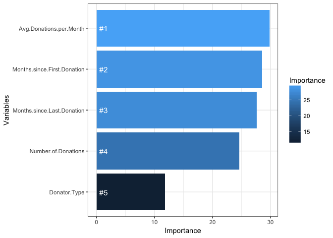

# Predict Blood Donations
Data Science 4 Good (Swiss)  
10/10/2017  


## 1 Introduction
Last update Monday 16.10.2017 17:04:10 CEST.

### 1.1 Load and Check Data

```r
#https://s3.amazonaws.com/drivendata/data/2/public/9db113a1-cdbe-4b1c-98c2-11590f124dd8.csv
train <- read.csv('data/TrainingData.csv', stringsAsFactors = F)
#https://s3.amazonaws.com/drivendata/data/2/public/5c9fa979-5a84-45d6-93b9-543d1a0efc41.csv
test  <- read.csv('data/TestData.csv', stringsAsFactors = F)

full  <- bind_rows(train, test) # bind training & test data
```
Even though datasets are not the same, test dataset doesn't have attribute which should be predicted, we have joined data together to get the complete overview.

```r
# check data
str(full)
```

```
## 'data.frame':	776 obs. of  6 variables:
##  $ X                          : int  619 664 441 160 358 335 47 164 736 436 ...
##  $ Months.since.Last.Donation : int  2 0 1 2 1 4 2 1 5 0 ...
##  $ Number.of.Donations        : int  50 13 16 20 24 4 7 12 46 3 ...
##  $ Total.Volume.Donated..c.c..: int  12500 3250 4000 5000 6000 1000 1750 3000 11500 750 ...
##  $ Months.since.First.Donation: int  98 28 35 45 77 4 14 35 98 4 ...
##  $ Made.Donation.in.March.2007: int  1 1 1 1 0 0 1 0 1 0 ...
```
We are working with 776 observations and 6 variables from which the last one is the one which we need to predict. We have got idea about what are the values in particular variables and that all of them are numeric.

Variable Name               |Description
----------------------------|--------------------------------------------------------
X                           |Id of record
Months.since.Last.Donation  |Number of monthis since this donor's most recent donation
Number.of.Donations         |Total number of donations that the donor has made
Total.Volume.Donated..c.c.. |Total amount of blood that the donor has donated in cubuc centimeters
Months.since.First.Donation |Number of months since the donor's first donation
Made.Donation.in.March.2007 |Probability that a donor made a donation in March 2007

## 2 Missing Values

```r
summary(full)
```

```
##        X         Months.since.Last.Donation Number.of.Donations
##  Min.   :  0.0   Min.   : 0.000             Min.   : 1.000     
##  1st Qu.:187.8   1st Qu.: 3.000             1st Qu.: 2.000     
##  Median :375.5   Median : 7.000             Median : 4.000     
##  Mean   :374.2   Mean   : 9.454             Mean   : 5.558     
##  3rd Qu.:558.2   3rd Qu.:14.000             3rd Qu.: 7.000     
##  Max.   :747.0   Max.   :74.000             Max.   :50.000     
##                                                                
##  Total.Volume.Donated..c.c.. Months.since.First.Donation
##  Min.   :  250               Min.   : 2.00              
##  1st Qu.:  500               1st Qu.:16.00              
##  Median : 1000               Median :28.00              
##  Mean   : 1389               Mean   :34.42              
##  3rd Qu.: 1750               3rd Qu.:50.00              
##  Max.   :12500               Max.   :98.00              
##                                                         
##  Made.Donation.in.March.2007
##  Min.   :0.0000             
##  1st Qu.:0.0000             
##  Median :0.0000             
##  Mean   :0.2396             
##  3rd Qu.:0.0000             
##  Max.   :1.0000             
##  NA's   :200
```
From summary prespective none of the attributes has N/A values except unknown 200 observations in test dataset for attribute which we need to predict.

## 3 Exploratory Analysis
### 3.1 Training Dataset Correlation
Initial investigation brought us the information we have all data numerical, so we can take a look closely to them and see what's the correlation amongs them and to the attribute which we want to predict.

```r
chart.Correlation(full[,2:6], histogram=TRUE, pch=19)
```

<!-- -->

Looking closer at the results it's clear that:

- _Number.of.Donations_ and _Total.Volume.Donated..c.c.._ are 100 % dependent (which was expectable) so we can use one of them only (I would vote for _Number.of.Donations_)
- After eliminating _Total.Volume.Donated..c.c.._ we can see that strongest correlation to attribute which we want to predict (_Made.Donation.in.March.2007_) have attributes _Months.since.Last.Donation_ and _Number.of.Donations_ so lets use those two for building the model.

## 4 Feature Engineering
Question if there is possibility to create some new feature is always a part of any kind of machine learning work. 

### 4.1 Average Donations per Month
Here is the simpliest one which came to my mind using all attributes (considering _Total.Volume.Donated..c.c.._ as equivalent to _Number.of.Donations_) it's _Avg.Donations.per.Month_ calculated as diff between _Months.since.First.Donation_ and _Months.since.Last.Donation_ and divided by _Number.of.Donations_.

```r
full$Avg.Donations.per.Month <- (full$Months.since.First.Donation - full$Months.since.Last.Donation) / full$Number.of.Donations

summary(full$Avg.Donations.per.Month)
```

```
##    Min. 1st Qu.  Median    Mean 3rd Qu.    Max. 
##    0.00    0.00    3.50    4.35    6.00   32.00
```
In some cases this new feature is 0 which indicate people who donate blood just once.

Let's take a look closely on relation to our original attributes:

```r
chart.Correlation(full[,2:7], histogram=TRUE, pch=19)
```

<!-- -->

With no big surprise the new feature doesn't helped us so much. It has strong correlation to _Months.since.First.Donation_ but weak to all other including _Made.Donation.in.March.2007_ which we want to predict.


```r
train$Avg.Donations.per.Month <- (train$Months.since.First.Donation - train$Months.since.Last.Donation) / train$Number.of.Donations

test$Avg.Donations.per.Month <- (test$Months.since.First.Donation - test$Months.since.Last.Donation) / test$Number.of.Donations
```

### 4.2 Donator types
The previous feature engineering wasn't successful so much. On the other hand correlation plot showed us that histogram of new feature is quite skewed. So, to make it better we can establish new feature based on previous one which will define groups of donator types. Let's define them and apply, but first take a look at histogram again.

```r
ggplot(data = full, mapping = aes(full$Avg.Donations.per.Month)) + 
  geom_histogram(breaks=seq(0, 32, by = .5), 
                 col="black", 
                 size = .5,
                 fill="orange", 
                 alpha = .5) + 
  labs(x="Avg Donations per Month", y="Count") + 
  xlim(c(0,32)) + theme_bw()
```

<!-- -->

Let's investigate conversion from numeric data to factors (_Donator.Type_), the boundaries (2.9,4.5, and 7) are given epirically by best split into groups (plus minimum 0 and maximum 32).

```r
full$Count <- 1 # add auxilary attribute

full.agg <- aggregate(Count ~ Avg.Donations.per.Month, data = full, FUN = sum)

full.agg$Donator.Type <- cut(full.agg$Avg.Donations.per.Month, c(0,2.9,4.5,7,32), labels = c("dt1","dt2","dt3","dt4"), include.lowest = F)
full.agg$Donator.Type <- factor(ifelse(is.na(full.agg$Donator.Type), "dt0", paste(full.agg$Donator.Type)), levels = c(levels(full.agg$Donator.Type), "dt0"))

full$Count <- NULL #get rid of auxilary attribute

full.donators <- aggregate(Count ~ Donator.Type, data = full.agg, FUN = sum)

ggplot(data = full.donators, mapping = aes(full.donators$Donator.Type, full.donators$Count)) + 
  geom_bar(stat="sum", 
           col = "black",
           size = .5,
           fill= "blue", 
           alpha = .5) + 
  labs(x="Donator Types", y="Count") + theme_bw()
```

<!-- -->

And now with those values we can establish new feature in full original datasets:

```r
train$Donator.Type <- cut(train$Avg.Donations.per.Month, c(0,2.9,4.5,7,32), labels = c("dt1","dt2","dt3","dt4"), include.lowest = F)
train$Donator.Type <- factor(ifelse(is.na(train$Donator.Type), "dt0", paste(train$Donator.Type)), levels = c(levels(train$Donator.Type), "dt0"))

test$Donator.Type <- cut(test$Avg.Donations.per.Month, c(0,2.9,4.5,7,32), labels = c("dt1","dt2","dt3","dt4"), include.lowest = F)
test$Donator.Type <- factor(ifelse(is.na(test$Donator.Type), "dt0", paste(test$Donator.Type)), levels = c(levels(test$Donator.Type), "dt0"))
```

*TODO - need to be finished and both engineered features can be tested in the SVM model ;-)*

## 5 Prediction
### 5.1 Model Tuning
It's not good idea to blindly train the model on train data and then submit the prediction on test data. So, let's first tune it a bit.

#### 5.1.1 Data Preparation
We can use test data split them to testing and training set and try to figure out which model would be the best.

```r
set.seed(123) #reproducibility
ind <- createDataPartition(y = train$Made.Donation.in.March.2007, p = 0.75, list = F)
train.train <- train[ind,]
train.test <- train[-ind,]
```

#### 5.1.2 Tunning prediction SVM
First algorithm which was chosen is Support Vector Machine from e1071 package. It's necessary to evaluate model better and tune the parameters. Documentation is here https://cran.r-project.org/web/packages/e1071/e1071.pdf. Tips on practical use here: https://cran.ms.unimelb.edu.au/web/packages/e1071/vignettes/svmdoc.pdf from which was taken idea to use tune.svn function.


```r
set.seed(123) #reproducibility
obj <- tune.svm(Made.Donation.in.March.2007 ~ Number.of.Donations + Months.since.Last.Donation, data = train.train, gamma = 2^(-1:1), cost = 2^(2:5), probability = T)
obj
```

```
## 
## Parameter tuning of 'svm':
## 
## - sampling method: 10-fold cross validation 
## 
## - best parameters:
##  gamma cost
##      2    8
## 
## - best performance: 0.1859035
```


```r
set.seed(123) #reproducibility
obj <- tune.svm(Made.Donation.in.March.2007 ~ Number.of.Donations + Months.since.Last.Donation, data = train, cost = 2^(2:5), gamma = 2^(-1:1) , probability = T)
obj
```

```
## 
## Parameter tuning of 'svm':
## 
## - sampling method: 10-fold cross validation 
## 
## - best parameters:
##  gamma cost
##      1    4
## 
## - best performance: 0.2108802
```
With this result we can perform the prediction either with recommended parameters for cost and gamma or with empirically found:

```r
set.seed(123) #reproducibility
svm_model <- svm(Made.Donation.in.March.2007 ~ Number.of.Donations + Months.since.Last.Donation, data = train.train, probability = T, gamma = 1, cost = 20)
pred <- predict(svm_model, train.test, probability = T)
```

#### 5.1.3 Tuning prediction RandomForest
Second algorithm based on discussion tips on DrivenData site under the cometition was RandomForest.


```r
set.seed(345)  #reproducibility
rf_model <- randomForest(factor(Made.Donation.in.March.2007) ~ Number.of.Donations + Months.since.Last.Donation + Months.since.First.Donation + Avg.Donations.per.Month + Donator.Type, data = train.train)

# Show model error
plot(rf_model, ylim=c(0,0.3))
legend('topright', colnames(rf_model$err.rate), col=1:3, fill=1:3)
```

<!-- -->


```r
# Get importance
importance    <- importance(rf_model)
varImportance <- data.frame(Variables = row.names(importance), Importance = round(importance[ ,'MeanDecreaseGini'],2))

# Create a rank variable based on importance
rankImportance <- varImportance %>% mutate(Rank = paste0('#',dense_rank(desc(Importance))))
```

```
## Warning: package 'bindrcpp' was built under R version 3.3.2
```

```r
# Use ggplot2 to visualize the relative importance of variables
ggplot(rankImportance, aes(x = reorder(Variables, Importance), y = Importance, fill = Importance)) +
  geom_bar(stat='identity') + 
  geom_text(aes(x = Variables, y = 0.5, label = Rank), hjust=0, vjust=0.55, size = 4, colour = 'white') +
  labs(x = 'Variables') + coord_flip() + theme_bw()
```

<!-- -->

```r
set.seed(345)  #reproducibility
rf_model <- randomForest(factor(Made.Donation.in.March.2007) ~ Avg.Donations.per.Month + Months.since.First.Donation + Number.of.Donations, data = train.train, sampsize = 5)

pred <- predict(rf_model, train.test, type = "prob")[,"1"] # we want to predict positive outcome probability
head(pred,5)
```

```
##     6     8    10    11    12 
## 0.330 0.462 0.286 0.460 0.440
```

#### 5.1.4 Tuning prediction (another algorithm from another package)
We can try carret package for example and another model like logistic regression or such. Please establish another section that we keep info what has been used and how to not repeat the same mistakes ;-). And please set the seed for reproducibility as you can see it above.

### 5.2 Model Evaluation
When we have binary classification problem we can simple caclulate accuracy and present cofusion matrix, but in this case when we calculate probability as output not the 1 or 0 class we need to evaluate it differently.

For such cases is calculated Logartimic loss which is quite opposite than accuracy which we are trying to maximize, this measure we are trying to minimize. With following formula for it's caluclation:

Log loss = −1/n ∑[yi log(ŷi) + (1 − yi) log(1 − ŷi)]

we can establish R funkction LogLossBinary (taken from here: https://www.r-bloggers.com/making-sense-of-logarithmic-loss/) which would be used for prediction evaluation. As it was mentioned above, we are trying to minimize this loss, so lower number is better :-).


```r
LogLossBinary = function(actual, predicted, eps = 1e-15) {
  predicted = pmin(pmax(predicted, eps), 1-eps)
  - (sum(actual * log(predicted) + (1 - actual) * log(1 - predicted))) / length(actual)
}

LogLossBinary(train.test$Made.Donation.in.March.2007, pred)
```

```
## [1] 0.5796463
```

### 5.3 Final Prediction
Once we have model with best algorithm option we can do the prediction on test data and submit it to DrivenData competition.

#### 5.3.1 Final Prediction with SVM

```r
set.seed(123)  #reproducibility
model <- svm(Made.Donation.in.March.2007 ~ Number.of.Donations + Months.since.Last.Donation, data = train, probability = T, gamma = 1, cost = 20)
pred <- predict(model, test, probability = T)
```

Evaluation notes about best features combination for prediction:

SVM Features Setup                                                              |Log Loss Evaluation |Log Loss DrivenData
--------------------------------------------------------------------------------|---------|---------
Number.of.Donations + Months.since.Last.Donation                                |0.9319239|
and gamma = 2, cost = 8                                                         |1.3473510|
and gamma = 1, cost = 4                                                         |0.8616842|0.8568
and gamma = 1, cost = 20                                                        |0.8366062|0.8535
Number.of.Donations                                                             |0.9653561|
Months.since.Last.Donation                                                      |0.9799749|
Months.since.First.Donation                                                     |0.9804339|
Number.of.Donations + Months.since.Last.Donation + Months.since.First.Donation  |1.8958200|

#### 5.3.2 Final Prediction with RandomForest

```r
set.seed(345)  #reproducibility
rf_model <- randomForest(factor(Made.Donation.in.March.2007) ~ Avg.Donations.per.Month + Months.since.First.Donation + Number.of.Donations, data = train, sampsize = 20)

pred <- predict(rf_model, test, type = "prob")[,"1"] # we want to predict positive outcome probability
```

Evaluation notes about best features combination for prediction:

RF Features Setup                                                                   |Log Loss Evaluation |Log Loss DrivenData
------------------------------------------------------------------------------------|---------|---------
Avg.Donations.per.Month                                                             |3.3900730|
Avg.Donations.per.Month + Months.since.First.Donation                               |2.3819310|
Avg.Donations.per.Month + Months.since.First.Donation + Months.since.Last.Donation  |1.9348560|
Avg.Donations.per.Month + Months.since.First.Donation + Number.of.Donations         |1.9057520|
and sampsize = 100                                                                  |0.7061318|
and sampsize = 50                                                                   |0.6488936|
and sampsize = 20                                                                   |0.6171891|0.5007
and sampsize = 10                                                                   |0.5850539|0.5017
and sampsize = 5                                                                    |0.5796463|

## 6 Write Output to File

```r
out <- data.frame(X = test$X, pred = pred)
names(out) <- c("","Made Donation in March 2007")
head(out, 5)
```

```
##       Made Donation in March 2007
## 1 659                       0.344
## 2 276                       0.402
## 3 263                       0.120
## 4 303                       0.426
## 5  83                       0.440
```

```r
write.csv(out, "data/BloodDonationSubmission.csv", row.names = F)
```
